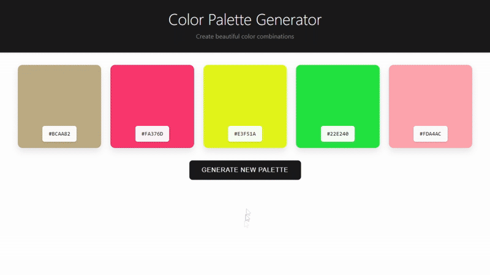

# Color Palette Generator 🎨

A sleek and professional color palette generator built with HTML, CSS, and JavaScript. Create beautiful color combinations with a single click!

## Demo



## Features

- Generate random color palettes instantly
- Professional black and white UI design
- Click to copy color codes
- Responsive grid layout
- Smooth animations and transitions
- Color code copy notifications
- Hover effects for better user interaction

## Getting Started

1. Clone the repository:
```bash
git clone https://github.com/srnox/palette-generator.git
```

2. Open `index.html` in your web browser:
- Double click the file
- Or use a local server if you prefer

No additional dependencies or setup required!

## Usage

- Click the "Generate New Palette" button to create a new color scheme
- Click any color code to copy it to your clipboard
- Hover over color boxes to see them elevate
- Use the copied color codes in your projects

## Project Structure

```
palette-generator/
├── index.html
├── assets/
│   └── demo.gif
└── README.md
```

## Contributing

1. Fork the repository
2. Create your feature branch (`git checkout -b feature/amazing-feature`)
3. Commit your changes (`git commit -m 'Add some amazing feature'`)
4. Push to the branch (`git push origin feature/amazing-feature`)
5. Open a Pull Request

## License

This project is licensed under the MIT License - see the [LICENSE](LICENSE) file for details.

## Acknowledgments

- Inspired by modern design principles
- Built with vanilla JavaScript for maximum compatibility
- Uses CSS Grid for responsive layout
